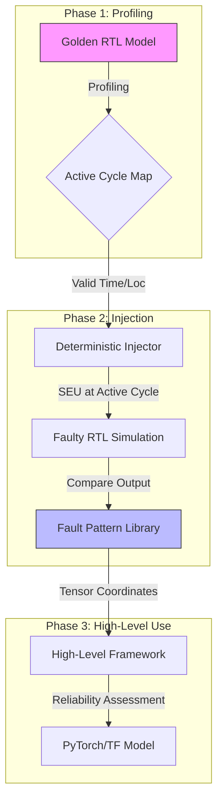

# Deterministic Fault Injection Framework for Systolic Arrays

[](https://opensource.org/licenses/MIT)
[]()
[]()
[]()

> **Bridging RTL Accuracy and High-Level Simulation Efficiency**

This repository houses the reference implementation for the paper **"Deterministic Fault Injection: Bridging RTL Accuracy and High-Level Simulation Efficiency for Systolic Arrays"**. It provides a comprehensive framework for validating the reliability of Deep Neural Network (DNN) accelerators against Single Event Upsets (SEUs).

---

## 📖 Introduction

Systolic Arrays (SAs) are the standard architecture for DNN acceleration, but validating their reliability is challenging. Traditional hardware-independent fault injection tools often rely on random bit-flips, which fail to capture the complex, spatially correlated fault patterns inherent to hardware execution.

**The "Validity Gap":**
Our research reveals that standard random sampling suffers from a severe validity gap—**only ~22% of randomly injected faults correspond to valid architectural failure modes**. The rest are physically impossible or irrelevant, wasting significant simulation resources.

**Our Solution:**
We present a framework that generates a **Fault Pattern Library** based on heuristic fault injection into a pure RTL model. By mapping low-level hardware SEUs to high-level tensor coordinates, we ensure **100% architectural representativeness** while cutting simulation overhead by **6x** compared to random baselines.

## ✨ Key Features

-   **Deterministic Fault Library**: Generates a catalog of valid fault patterns for **Input Stationary (IS)**, **Output Stationary (OS)**, and **Weight Stationary (WS)** dataflows.
-   **RTL-Level Accuracy**: Captures complex fault topologies like **Row-Group Corruptions** and **Multi-Channel Wavefronts** that random injection misses.
-   **High-Level Bridge**: Maps physical SEUs directly to tensor coordinates (Channel, Row, Column), enabling high-level frameworks (PyTorch/TensorFlow) to simulate realistic hardware faults.
-   **Massive Efficiency**: Eliminates invalid injection trials, achieving high-fidelity reliability assessment with minimal computational cost.

## 🏗 Overall Methodology

The framework operates in two distinct phases to bridge the gap between physical accuracy and simulation speed.



1.  **Active Cycle Profiling**: We profile the RTL to identify exact "Active Validity Intervals" for every Processing Element (PE).
2.  **Parallel Fault Injection**: We exhaustively inject SEUs only into active cycles to capture deterministic failure modes.
3.  **Pattern Characterization**: Faults are classified into **Single**, **Row-Group**, and **Multi-Channel** topologies.

## 🧠 Implementation Internals

The core logic is implemented across three optimized Python drivers (`run_fault_campaign_ver10_*.py`). Below are the specific architectural handling strategies for each dataflow:

### 1. Parallel Execution Engine
To handle the massive computational load of exhaustive injection, all scripts employ a **Producer-Consumer** architecture:
-   **Safe Concurrency**: Each worker process spawns a unique `tmp_workers/job_{pid}` directory to generate distinct `.mem` files (weights/inputs) and binary executables, preventing race conditions during parallel `iverilog` execution.
-   **Anti-Masking Data**: The simulation is driven by random **non-zero integer data** (torch.randint). This is critical to prevent "Zero-Masking" (where $0 \times \text{fault} = 0$), ensuring that the hardware logic is actively exercised and faults have a valid path to propagate.

### 2. Input Stationary (IS) Logic
*File: `systolic_RTL_simulator_IS/run_fault_campaign_ver10_is.py`*
-   **Data Mapping**: 
    -   `act.mem`: Inputs are stationary, flattened in Row-Major order.
    -   `weight.mem`: Weights are streamed. The script generates a **Diagonal Wavefront**, injecting delay bubbles ($Delay = Row$) to align operand arrival times at the PEs.
-   **Fault Mapping**: The script calculates the "Output Diagonal" to map physical time to tensor coordinates using:
    $$T_{arrival} = k_{filter} + c_{channel} + \text{OFFSET}$$
    This allows us to reverse-map a failure at cycle $T$ back to specific $(C_{out}, H, W)$ tensor coordinates.

### 3. Output Stationary (OS) Logic
*File: `systolic_RTL_simulator_OS/run_fault_campaign_ver10_os.py`*
-   **Banked Memory Support**: To support realistic FPGA Block RAMs, the OS driver implements detailed **Memory Interleaving**:
    -   `m0.mem`/`m1.mem` are generated with interleaved banks (Bank 0: Row 0, 8...; Bank 1: Row 1, 9...).
    -   Input matrices are padded to `M_SIM` size to align with bank boundaries.
-   **Reverse Draining & Bubble Handling**: 
    -   In OS, results drain vertically. The script handles the **single-cycle bubble** inherent to the drain pipeline (Valid Data $\to$ Bubble $\to$ Valid Data).
    -   Column mapping is reversed due to the push-out logic: `local_col = (N-1) - ((valid_idx // 2) % N)`.

### 4. Weight Stationary (WS) Logic
*File: `systolic_RTL_simulator_WS/run_fault_campaign_ver10.py`*
-   **Stationary Weights**: Weights are pre-loaded into local PE registers.
-   **Streaming Inputs**: Inputs are streamed horizontally with a skew.
-   **Active Cycle Maps**: Crucially, the script relies on `active_cycles_map_ws_{layer}.json`, a pre-computed dictionary that defines the exact `[Start, End]` cycle window for every PE, derived from Phase 1 profiling.


## 🚀 Installation

### Prerequisites
-   **Python 3.8+** (Required for verification drivers)
-   **Icarus Verilog (iverilog)** or **Vivado** (For RTL simulation)
-   **Make** (Optional)

### Setup

```bash
# Clone the repository
git clone https://github.com/Tvdnguyen/Systolic-Fault-Injection.git
cd SystolicArray_FPGA/ver10

# Install dependencies
pip install numpy matplotlib
```

## ⚡ Running the Framework

The project is organized by dataflow. You can run individual campaigns to generate fault patterns or verify the architecture.

### 1. Input Stationary (IS) Campaign
Targeting input-reuse workloads.

```bash
cd systolic_RTL_simulator_IS
# Run basic verification
python run_fault_campaign_ver10_is.py

# Run full fault injection (generates pattern library)
python run_fault_campaign_ver10_is.py --inject True --samples 10000
```

### 2. Output Stationary (OS) Campaign
Targeting partial-sum accumulation.

```bash
cd systolic_RTL_simulator_OS
python run_fault_campaign_ver10_os.py --inject True
```

### 3. Weight Stationary (WS) Campaign
Targeting weight-reuse efficiency.

```bash
cd systolic_RTL_simulator_WS
python run_fault_campaign_ver10_ws.py
```

## 📂 Folder Structure

```
ver10/
├── systolic_RTL_simulator_IS/    # [IS] Input Stationary Implementation
│   ├── pe_is.v                   # PE Logic for IS
│   ├── active_cycles_map_is...   # Pre-computed active cycle maps
│   └── ...
├── systolic_RTL_simulator_OS/    # [OS] Output Stationary Implementation
│   ├── pe_os.v                   # PE Logic for OS
│   └── ...
├── systolic_RTL_simulator_WS/    # [WS] Weight Stationary Implementation
│   └── ...
└── README.md                     # Documentation
```

## 🤝 Contribution Guidelines

We welcome contributions to expand the Fault Pattern Library or support new dataflows.
1.  Fork the repo.
2.  Create a feature branch.
3.  Ensure all RTL changes pass the `run_fault_campaign` regression tests.
4.  Submit a Pull Request.

## 📜 License

Distributed under the **MIT License**. See `LICENSE` for more information.


---
<p align="center">
  <b>Concordia University</b> &bull; <b>CY Cergy Paris University</b>
</p>
